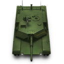
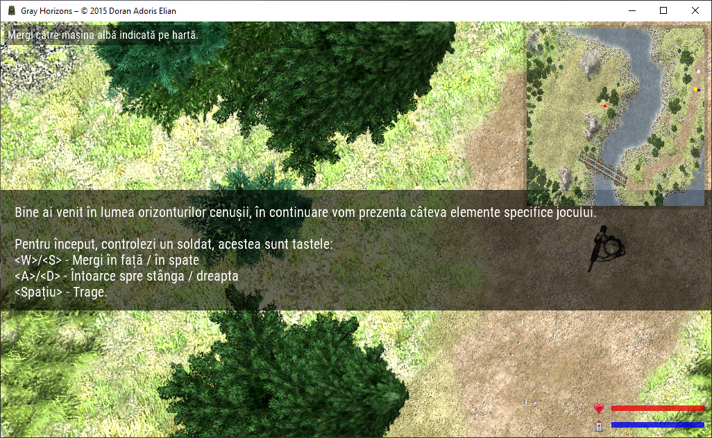
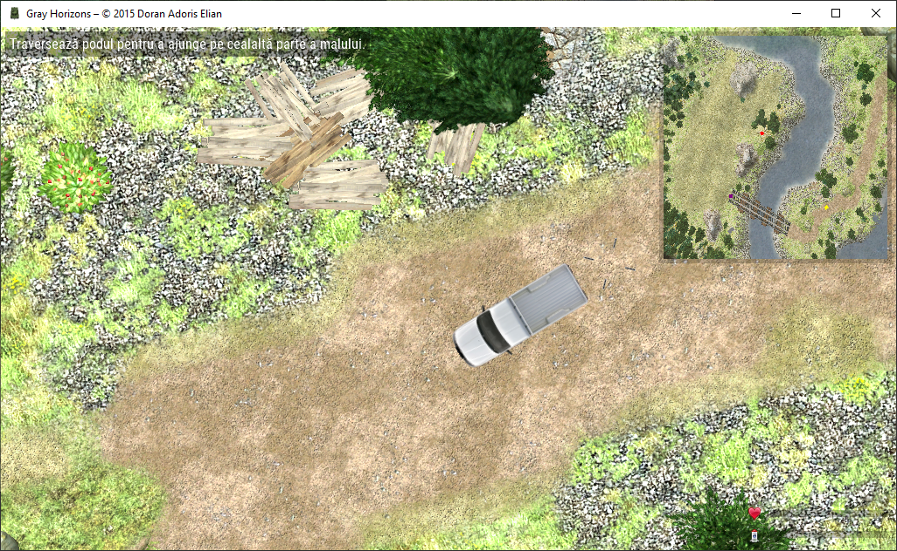
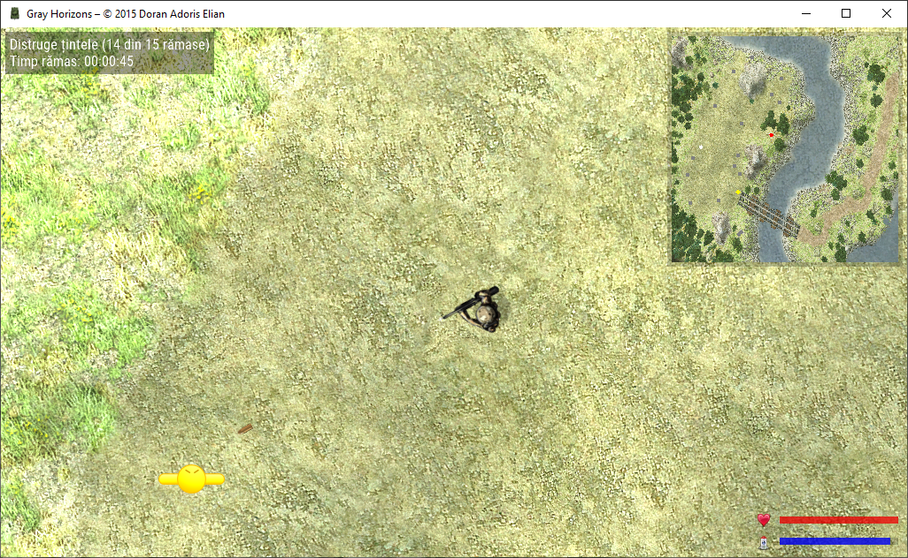
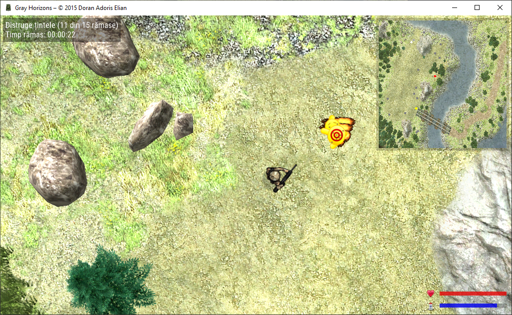
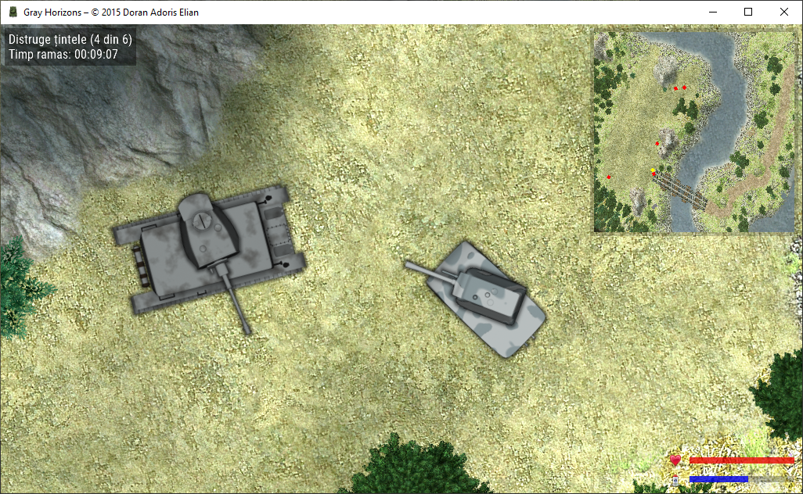

#  Gray Horizons

_Demonstrative 2D top-down video game with realistic graphics created for a software contest. Custom game engine written in C# and based on MonoGame._

## Requirements
* *OpenAL 2.0.7.0* by CreativeLabs. Provided in the release archive, in the same directory as the game.

## Configuration
In order to change the keyboard key mappings or the resolution, the `config.xml` file must be edited manually.

## Screenshots

